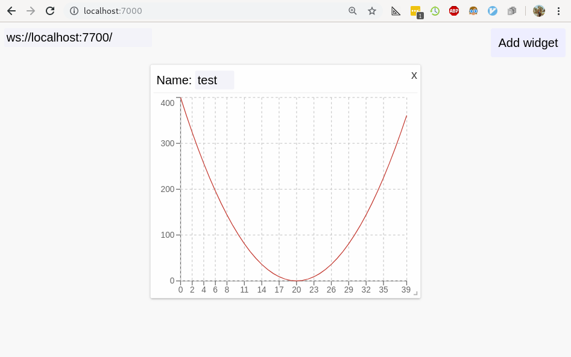

Quick start
===========

First steps
-----------

Fire up your ``python`` interpreter or jupyter notebook
and type the following:

.. code-block:: python

   from webvis import Vis
   vis = Vis()
   vis.start()
   vis.vars.test = [ x**2 for x in range(-20,20) ]

Now, open `localhost:7000 <http://localhost:7000>`_ in your browser.

There's not much there now, 
but let's go ahead and click 'Add Widget' button at the top left.

Widgets are basic blocks of our dashboard, you can drag them and resize.

Type in the name of your variable, ``test``, and your array will appear.

Interactive
-----------

Now, the most awesome feature about libvis is that
python objects from ``vis.vars`` are *automatically synchronized*.

Try this one:
::
   v.vars.test += [20**2]*5

Any time you assign to an attribute of ``Vis.vars``, stores it in a 
special place, and another thread that listens to updates sends data 
to the app via websocket.

